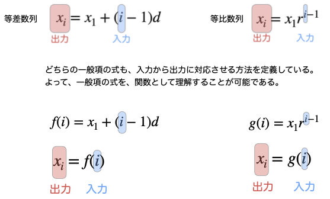
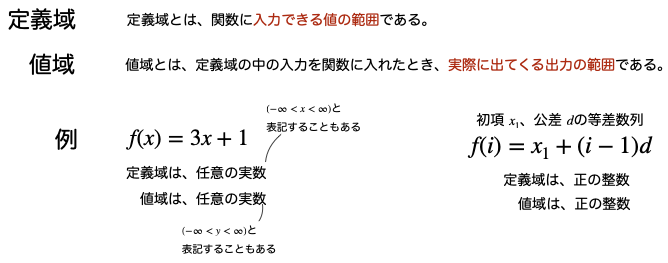
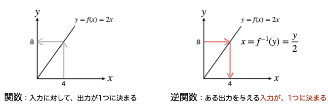
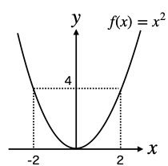
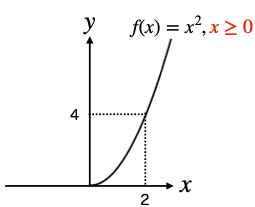
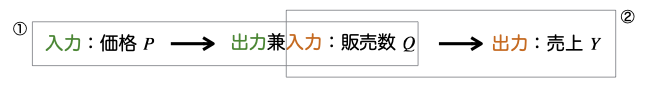
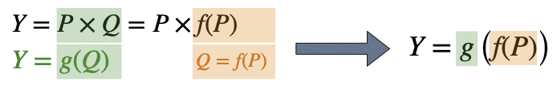
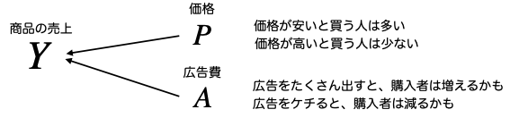

# 関数

## 関数の定義

データサイエンスで使う「関数(function)」とは、数値やデータなどを**入力**し、さまざまな**計算**を実行して、計算結果を**出力**する仕組みのことである。3つの役割と名称について、まずは理解しよう。

* **入力変数**または単に**入力**(input)。
* 関数の**名前**。計算を実行する本体に付けられた名称。
* **出力変数**または単に**出力**(output)。


入力に数値やデータをいれると、関数$f$の中で計算されて、結果が出力される。このような"流れ"を「入力と出力の**対応**関係」と表現することもある。

## 数列も関数の一種

等差数列や等比数列の**一般項**の計算は、
1. $i$番目の数列の値$x_i$を計算したいので、添字$i$を入力に入れる
2. 一般項の式に、入力の$i$を用いて値を計算する
3. 計算結果を$x_i$にセットする

というように作業の流れを関数のように表現することが可能である。



ここでは、一般項の式という関数によって、添字$i$と計算結果$x_i$の対応関係が得られている。

## 関数の定義域と値域

関数を定義する際には、入力として許容される値の範囲(**定義域**)と、その結果出力のとり得る値の範囲(**値域**)をセットで定義することがある。



一次関数の場合は、任意の実数を定義域・値域に設定することが多い。

一方で、数列の入力は添字＝正の整数であることがほとんどであるため、定義域(添字の範囲)を正の整数と設定している。

上図のように初項や公差が正の整数である場合には、数列の値域も正の整数となる。

```{important}対応関係について

データサイエンスで扱うさまざまな関数では、ひとつの入力に対して、**出力がひとつに定まる**ことを必要としていることが多い。

傾きが$a$、切片が$b$の一次関数ならば、任意の入力$x$に対して、$f(x)=ax+b$という関数は、**ただひとつの出力**を計算してくれる。

等差・等比数列ならば、任意の正の整数である添字$i$について、一般項の式に従って、ただひとつの出力を計算してくれる。

ふたつとも当たり前に感じるが、この"要件"が満たされないケースが確かに存在する。それは「逆関数」を考えるときである。
```

## 逆関数

関数$f$に入力$x$を入れて、$f(x)$が計算し、その結果の出力$y$を得るという対応関係を、
$$
x\mapsto y
$$
という対応関係($\mapsto$という矢印記号)で表すことにする。

この関数$f$について、「**では、出力$y$から入力$x$を逆算して求めることができるか**」と問うことがある。この場合は、上の対応関係を前提として、
$$
y \mapsto x
$$
という対応関係の有無を調べることになる。

$x\mapsto y$という対応関係がある関数$f$に、同時に$y\mapsto x$という対応関係を与える関数が存在するとき、この関数を関数$f$の**逆関数**と呼び、$f^{-1}$という記号で表す。



上左図の一次関数では、関数$f(x)=2x$によって
$$
4\mapsto 8
$$
という対応関係がある。では、逆に「**出力8**に対応する入力が**ひとつに定まるか**」という問いに対して、確かにひとつの「**入力4**」が対応していると確認したのが、上右図である。

逆関数が存在しない関数とはどういうものだろうか。その典型的な例として、二次関数$f(x)=x^2$を調べてみよう。



この関数には、ひとつの入力に対して、ひとつの出力が対応している。例えば入力$x=2$のとき、出力は「4」がひとつだけ定まる。

では「**出力4に対する入力はひとつに定まるか**」という問いを考えてみよう。すると、二次関数の出力4をもたらす入力は「**2つ**($x=2,-2$)」あることが分かる。この場合、関数$f(x)=x^2$に対する逆関数は**存在しない**と表現する。

### 定義域と逆関数の存在

逆関数が存在しない関数$f(x)=x^2$も、**定義域を変えれば**逆関数が存在することがある。下図は、$f(x)=x^2$を**0以上の入力**を定義域としたものである。



すると、出力「4」を与える入力は「2」の**ひとつに定まる**。(-2を考えなくてよいのは、定義域を$x\ge 0$に設定しているから)。

$f(x)=x^2$は、定義域を変更することで逆関数$f^{-1}(x)$が存在することになる。

```{note}逆関数が存在しないことは悪いこと？
「関数$f$に逆関数$f^{-1}$が存在しない」と書かれると、この関数$f$は欠陥品？みたいな印象をもってしまうかもしれない。それは誤解である。

商品の売上といったビジネスに目を向けてみると、関数に逆関数が存在することはまれである。

例えば商品の売上が上がった/下がったという現象に対して、売上(出力変数)がさまざまな店舗環境を表す入力変数で構成される関数で表されるとする。

このとき、売上の逆関数が存在するということは、どんな売上でも、そこから逆算して上がった/下がった要因がひとつの入力の値で定まることになる。こんなビジネスはとても楽であるが、消費者の購入行動は移り気で、とてもじゃないけどひとつの入力で決められるわけではない。
```

## 合成関数

関数の中には、ひとつの入力が、「中間の関数」を経由して出力が決定される特徴をもつものがある。ビジネスのデータサイエンスで代表的な例としては、店舗や企業が小売価格をいろいろ変更したときに得られる**売上**がある。企業は、設定した価格によって売上が決まるものであるので、

* 入力：設定した価格
* 出力：売上(円)

という対応関係：価格$\mapsto$売上という「関数」を持っている。

ところが、経済学の基礎理論「需要の法則」で学んだように、価格に対する売上の対応関係の中には、企業が商品を買う消費者の行動が含まれている。消費者は価格によって買うか買わないかを決める。この結果、価格を設定した影響は、まず「**販売数量**」に現れるのである。



最終的な企業の売上は、設定した価格に販売数量を掛け算した金額になる。すると、企業の売上関数の対応関係$P\mapsto Y$は、実際には、

$$
P\mapsto Q
$$
という中間段階を経て
$$
Q\mapsto Y
$$

という2段階の対応関係によって構成されていることが分かる。

このような中間段階を別の関数で表す方法を、**合成関数**と呼ぶ。



上図では、売上が価格$P$と数量$Q$で定義されるが、消費者の需要の法則に従った行動の結果としての数量$Q$が、価格$P$によって決定されるという状況を表している。このとき、**合成関数**は次のように作られる。

1. まず、価格$P$を入力、購入数量を出力$Q$とした関数$f(P)$で表す
    * $Q=f(P)$という関数が出来上がる
2. 次に、購入数量$Q$を入力、売上$Y$を出力とした関数$g(Q)$で表す
    * $Y=g(Q)$という関数が出来上がる
3. 1.の$Q=f(P)$を、2.の関数$g$の入力$Q$に代入(**合成**)する
    * $Y=g(Q)\equiv g(f(P))$という**合成関数**が出来上がる

すると、$Y=g(f(P))$という式は、

* まず、企業が価格(入力変数)$P$を用意する
* すると、消費者行動を表す$f(P)$によって購入数量$Q$("中間"出力変数)が計算される
* $Q$を入力として売上("最終"出力変数)$Y=g(Q)$がもとまる

という、「消費者行動が介在する売上関数」を表現していることになる。

### 合成関数の表記法と適用順のルール

$Y=g(f(P))$という表現は、カッコが増えて読みづらいことがあるので、
$$
Y = g\circ f(P)
$$
という表記をすることも多い。私たちが理解しなければならないのは、どちらの表記であれ、

**入力変数に近い順に、関数を適用する(この場合、$f$ の次に $g$)**

という、合成関数の表記ルールである。

### 合成関数の問題の解き方

**例題1**: $f(x)=x^2$、$g(x)=3x$と定義するとき、$f\circ g(x)$を計算しなさい

**解法**

$f\circ g(x)$は$f(g(x))$のことである。

1. $g(x)$の定義式($3x$)を、$f(x)$の$x$の場所に代入する。
    * $f(x)$の$x$を$g(x)=3x$に置き換えて$f(3x)$と書く。
2. $f(3x)$を$f$の定義で表現する。
    * 入力は$3x$なので、$f(x)=x^2$の$x$を、$3x$に置き換える
3. $f(3x) = (3x)^2$を計算する
    * $f(3x) = (3x)^2=9x^2$が$f\circ g(x)$の計算結果。

**例題2**：$f(x)=x+5$、$g(x)=2x$と定義すると、合成関数$f\circ g(x)$と$g\circ f(x)$を求めなさい。

**解法**

$f\circ g(x)$は、$f(x)$の定義式の$x$を$g(x)$の$2x$で置き換えて
$$
f\circ g(x) = (2x) + 5 = 2x+5
$$

$g\circ f(x)$は、$g(x)$の定義式の$x$を$f(x)$の$2x+5$で置き換えて
$$
g\circ f(x) = 2(x+5) = 2x+10
$$

このように、合成関数は適用する順番が重要で、一般的に$f\circ g \neq g\circ f$である。


## 2変数以上の関数

関数は、2つ以上の変数を入力に設定することも多い。例えば、商品の売上は、価格だけでなく、CMといった広告（プロモーション）も重要な原因である。



このようなとき、ひとつの出力$Y$は2つ(以上)の入力($Q$,$P$)で決まるとして、次のように入力をカンマで区切って表記する。

$$
Y = f(P,A)
$$

ビジネス分析やデータサイエンスの世界では、2つ以上の入力が1つの出力に対応する関数を扱うことがとても多い。そのうち代表的なケースは、「最適化問題」という「データサイエンス基礎I」の学習目標の中で紹介する予定である。