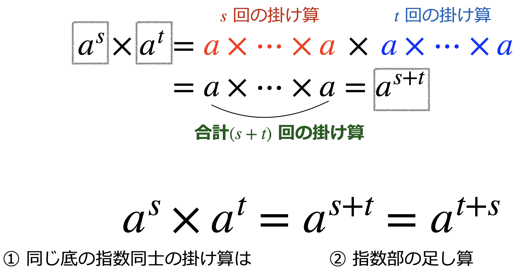
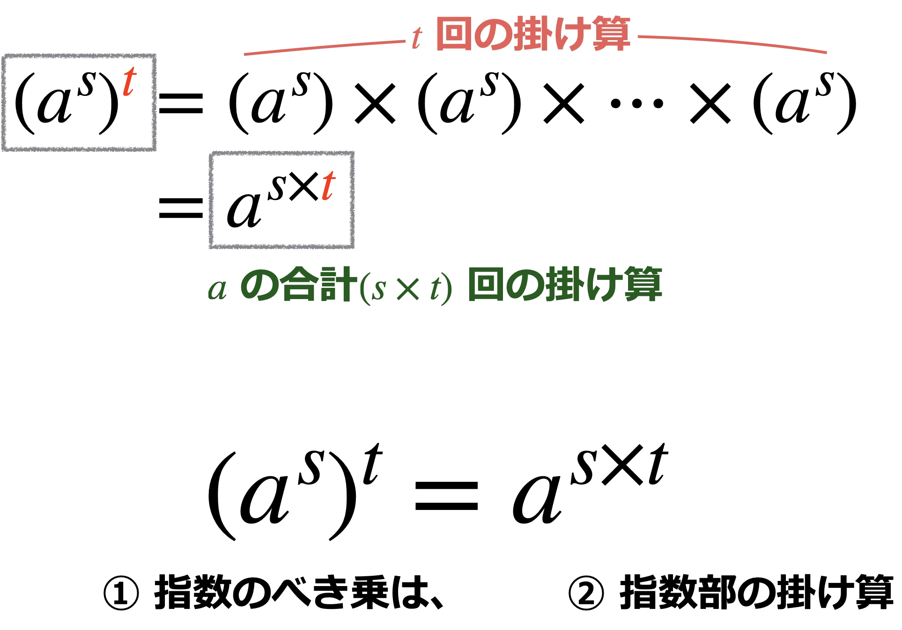
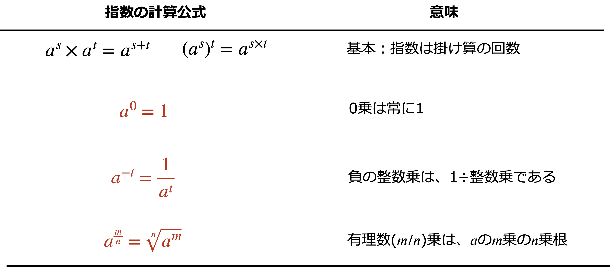
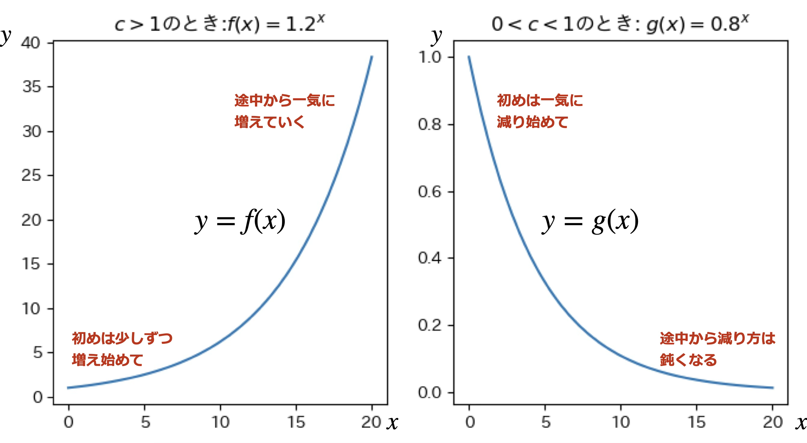

# 指数関数

## 底と指数

指数は、掛け算に関する表記をシンプルにするために導入された数学記法である。

**同じ数**を**いくつ掛けたか**ということを表すために、**底**と**指数**という数学用語が定義される。まずはこれらの用語をしっかり理解しよう。


上図では、底「2」が指数「6個」だけ掛け算されている。このような指数の表記に対して、「底のべき乗」と表現することもある。上図では「2のべき乗」と呼ぶ。

## 指数の法則：2つの基本ルール
底を正の数$a$、指数部$s,t$は自然数(正の整数)とする。

### 同じ底の指数同士の掛け算は、指数の足し算



### 指数のべき乗は、指数の掛け算



```{admonition}指数の法則：2つの基本ルール
1. $a^s\times a^t = a^{s+t} = a^{t+s}$
2. $(a^s)^t = a^{s\times t} = a^{t\times s}$
```

```{note}言葉の使い方に注意!
授業や、この資料では、「**掛け算の回数**」「**掛け算の個数**」に関して説明している箇所がある。

多くの人は、これらを**掛け算記号$\times$の個数**で把握しているかもしれないが、次のように理解していただきたい。

底$a$の掛け算の回数は、掛け算記号の個数に1を足したものである：

1. $a$：**掛け算は1回**。掛け算記号の個数は0個。
2. $a\times a$：掛け算は2回。掛け算記号の個数は1個。
```

## 指数の法則の応用：3つの追加ルール

```{admonition}指数の法則：3つの追加ルール

* 有理数乗の表記で**特によく使われるのは、$n$乗根を$\frac{1}{n}$で表す方法**：$\sqrt[n]{a} = a^{\frac{1}{n}}$
```

## 指数関数

**2つの指数法則**によって、

* 指数が正の整数のときの計算方法

が定義された。

2つの指数法則を応用した**3つの追加ルール**によって、

* 指数が0、マイナス、有理数($\frac{m}{n}$のような分数)のときの計算方法

が定義された。

指数の計算方法は、さらに一般的な"実数"(上記以外で表せない数値)まで定義することができる。

入力$x$の定義域を任意の実数$(-\infty, +\infty)$に拡張したとき、**底を$a$とする指数関数**:
$$
f(x) = a^x
$$
が定義される。そして指数関数の**出力の特徴を、グラフなどで観察する**ことが可能になる。

ただし、私たち(人間)が計算したり答えを求める作業は、2つの法則と3つの追加ルールに限定されると考えて差し支えない。実数まで定義域を拡張した指数関数は、パソコンとアプリ/プログラミングによって計算を行うことがほとんどである。


## 指数関数の出力の特徴

指数関数 $ f(x) = a^x $ では、底 $ a $ の大きさによってグラフの形が変わる。データサイエンスやビジネス分析で特に重要なのは、

* 底が1より大きい($a>1$)
* 0と1の間にあるとき($0<a<1$)

の2つのケースである。



$a$のそれ以外の値の範囲については、基本的に気にしなくてよい。
* $a = 1$ のとき：$f(x)=1^x$は変化せず、常に1。
    * 1だけを何個掛けても、出力は常に1である。
* $a<0$のケースは、データサイエンスやビジネス分析ではめったに現れないので、考えなくてよい。
    * 正負の符号が激しく入れ替わる、振れ幅の激しいグラフになる。

## 複数の指数関数の計算

### 関数同士の掛け算

指数の入力$x$が同じでも、底が異なる2つの関数：$f(x)=a^x$、$g(x)=b^x$は、指数の法則を適用することができないことに注意しよう。例えば、ふたつの関数の掛け算：

$$
f(x)\times g(x) = a^x\times b^x \quad (\neq (ab)^x)
$$

は、これ以上計算を進めることができない。**指数の法則**(および追加ルール)は、**指数関数の底が同一**であるときのみ、使うことができる。

2つの関数の底が同じ、または指数の法則などを使って同じに変形できるならば、今回学んだ方法を使って、関数同士の掛け算を行うことができる。例えば、一見すると底が異なる2つの関数：

$$
f(x) = 3^x,\quad g(x) = 9^x
$$

では、指数の法則を使って$g(x) = (3^2)^x = 3^{2x}$と変形できるので、

$$
f(x)\times g(x) = 3^x\times 3^{2x}
$$

と変形することができる。底が3で揃っているので、この式には指数の法則を適用して、計算を進めることができる：

$$
f(x)\times g(x) = 3^x\times 3^{2x} = 3^{x+2x} = 3^{3x}
$$
