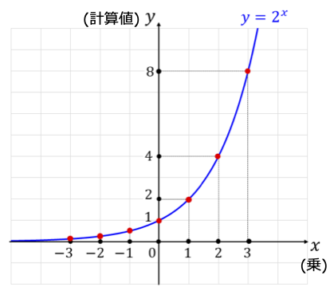
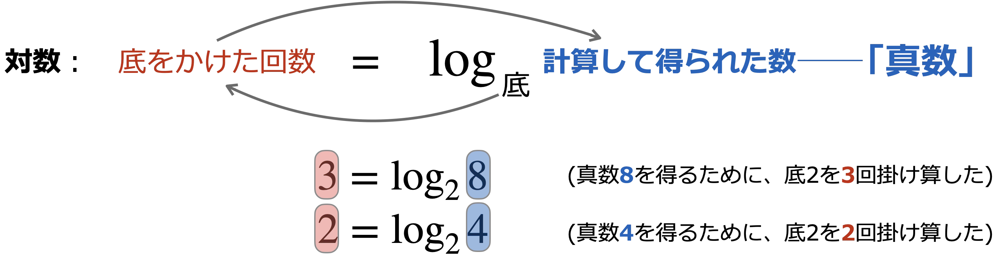
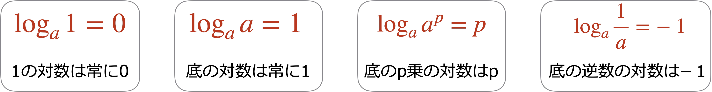
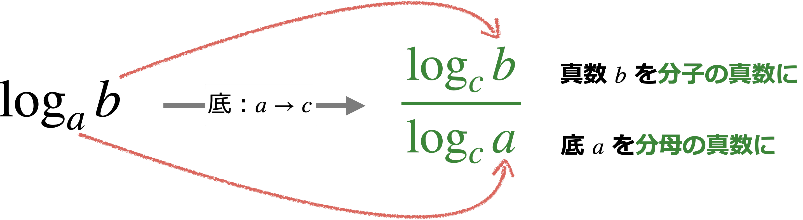

# 対数関数

## 定義

下図は底が2の指数関数$y=2^x$のグラフを表している。指数の定義から、指数関数$f(x)=2^x$の出力(計算値)は、**底2を$x$回掛け算**した結果である。



**指数関数の出力**(計算値)を得るために、底を掛け算した回数を、**対数**(logarithm)と定義する。

例えば、底2を3回掛け算すると、8になる。**では**、8という計算値("真数")を得るために、2を掛け算する回数は何回か？→3回。この回数(3)を、底を2とする8の対数と呼ぶ。

```{important} 対数・底・真数の関係

```

### 対数の求め方

対数の計算では、ExcelやR, Pythonなどアプリやプログラミングを用いることが多いが、手計算で対数を求めることも少なくない。その場合は、常に上の考え方に従って求めることが重要。

1. 底が10のときの1000の対数=$\log_{10}1000$は？
    * 真数1000を得るために、10を何回掛け算するか？→ $1000=10\times 10\times 10$なので、3回。よって、$\log_{10}1000=3$
2. 底が2のとき、$\frac{1}{2}$の対数は？
    * 真数$\frac{1}{2}$を得るために、2を何回掛け算するか？→ 指数の法則を思い出そう。$\frac{1}{2}$は2の「マイナス1乗」だから、$\log_{2}\frac{1}{2}=-1$

## 対数の特徴



## 対数の公式(必ず使う)

### 掛け算の対数は、対数の足し算

底が同一($a$)のとき：
$$
\log_aMN = \log_aM+\log_aN
$$

**(具体例)**

$a=10$、$M=1000$、$N=10$と設定して
$$
\log_{10}1000\times 10
$$
を考えよう。$1000\times 10=10000$だから、左辺の値は「10000を得るために10を4個掛ける」と考えれば、この対数は4になる。

同様の考え方で、右辺の各項は
$$
\log_{10}1000 = 3,\,\log_{10}10 = 1
$$
となるから、右辺の式は
$$
3+1(=4)
$$
となり、左辺の対数の値と等しいことが確認できる。

### 割り算の対数は、対数の引き算

底が同一($a$)のとき：
$$
\log_a\frac{M}{N} = \log_aM-\log_aN
$$

**具体例**

$a=10$、$M=1000$、$N=10$と設定して
$$
\log_{10}\frac{1000}{10}
$$
を考えよう。$1000/10=100$だから、左辺の値は「100を得るために10を2個掛ける」と考えれば、この対数は2になる。

同様の考え方で、右辺の各項は
$$
\log_{10}1000 = 3,\,\log_{10}10 = 1
$$
となるから、右辺の式は
$$
3-1(=2)
$$
となり、左辺の対数の値と等しいことが確認できる。

### 指数の対数は、対数の指数倍

$$
\log_aM^k = k\log_a M
$$
真数($M$)の$k$乗の対数を求めよ、といわれたら、単に$k$倍すると覚えておこう。

(**具体例**)

$a=10$、$M=10$、$k=4$とすると、左辺は
$$
\log_{10}10^4
$$
となる。真数は$10^4=10000$である。右辺の対数項は
$$
\log_{10}10=1
$$
なので、右辺全体は
$$
4\times 1 = 4
$$
となり、左辺と等しいことが確認できた。


### 対数の底の変換公式

対数の底が$a$、真数が$b$で、$\log_ab$と表されているとする。ここで、**底を$a$から$c$に変更したい**。このときに使われる公式が、底の変換公式である。
$$
\log_a b = \frac{\log_c b}{\log_c a}
$$

公式が少し複雑な形をしているので、下の図で理解しよう。



* 元の底$a$は、新しい底$c$の真数となり、分母へ。
* 元の真数$b$は、新しい底$b$の真数となり、分子へ。

#### 底の変換公式の使われどころ

(**典型的局面1**) 底が揃っていない式を処理したい。
$$
\log_23\times \log_35\times \log_52
$$
この式は3つの対数の掛け算だが、底が揃っていない。→ そこで、何かの底に統一してみる。どの底に統一する？

* 方針1：使われている底のどれかひとつを選ぶ。
* 方針2：10とか、7とか、使われていない数字を選択する。

どちらでも計算の負荷は同じであることが多い。

例えば、方針1に従って底を「5」に統一してみよう。

$$
\begin{align*}
\log_23\times \log_35\times \log_52 &= 
\frac{\log_53}{\log_52}\times \frac{\log_55}{\log_53}\times \frac{\log_52}{\log_55}\\
&= 1
\end{align*}
$$
変換公式を使うと、約分できる項が次々に現れることが多い。

次に、方針2にしたがって、底を、どの項も底に使っていない「7」に統一してみよう。変換公式を使うと：

$$
\begin{align*}
\log_23\times \log_35\times \log_52 &= 
\frac{\log_73}{\log_72}\times \frac{\log_75}{\log_73}\times \frac{\log_72}{\log_75}\\
&= 1
\end{align*}
$$

同様に約分できる項が次々に現れる。

## 対数方程式

対数の真数部に未知数を含む方程式を、対数方程式という。もっとも単純な対数方程式と、解の求め方は次のとおりである。


対数方程式のバリエーションとして、真数に$x$を含む式が現れることがある。その場合は、$\log_ax$の項を作るように、対数の公式を使って変形するのが主な解法である。例えば以下のようなケースである。

* $\log_a(5x) = \log_a b$
    * 左辺を$\log_a5+\log_ax$と変形すればよい。
    * $\log_a5+\log_ax=\log_ab\iff \log_ax = \log_a\frac{b}{5}\iff x=\frac{b}{5}$
* $\log_a(\frac{x}{5}) = \log_a b$
    * 左辺を$\log_ax-\log_a5$と変形すればよい。
    * $\log_ax-\log_a5=\log_ab\iff \log_ax = \log_a 5b\iff x=5b$
* $\log_a(x^5) = \log_a b$
    * 左辺を$5\log_ax$と変形すればよい。
    * $5\log_ax=\log_ab\iff \log_ax = \log_ab^{1/5}\iff x=b^{1/5}$

上記3つの"略解"では、対数の性質が何度も使われているので、確認しておくこと。

### 対数をとる
等式
$$
x=b
$$
が成り立っているとき、両辺を対数に変換した
$$
\log_ax=\log_ab
$$
も成立する。このように、両辺を「対数化」することを、**対数をとる**と表現する。

## 対数関数と指数関数は、逆関数の関係
対数の定義から、
$$
f(x)=\log_ax
$$
とは、$a$ を $f(x)$個掛けると、真数$x$になるということである。$f(x)$の計算値を$y$とおくと、$a$を$y$個かけると$x$になると表現することができる。このことは、指数の定義を使えば、
$$
x = a^y
$$
と表現できることを確認しよう。指数関数は、
$$
y = a^x
$$
と書くことができる。これら2つの式を見比べると、$y$と$x$の役割が逆になっていることが分かるだろう。


## 対数関数の出力

対数関数を使った入力と出力には、「元の入力の相対的な大きさを変更する」という特徴がある。


同じ長さだけ入力を増やしたときでも、出力の増加量は一定ではない。

* 入力が**小さい**領域では、出力は**大きく増加する**。
* 入力が**大きい**領域では、出力は**少ししか増加しない**。

つまり、対数関数は「大きな入力値の違いを圧縮する関数」と表現することもできる。