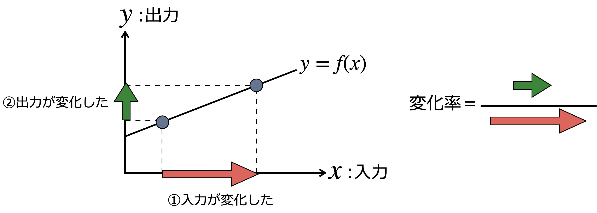
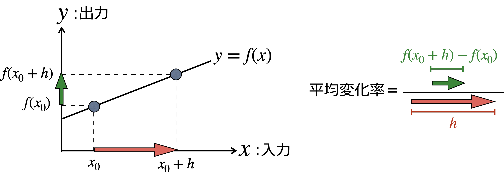
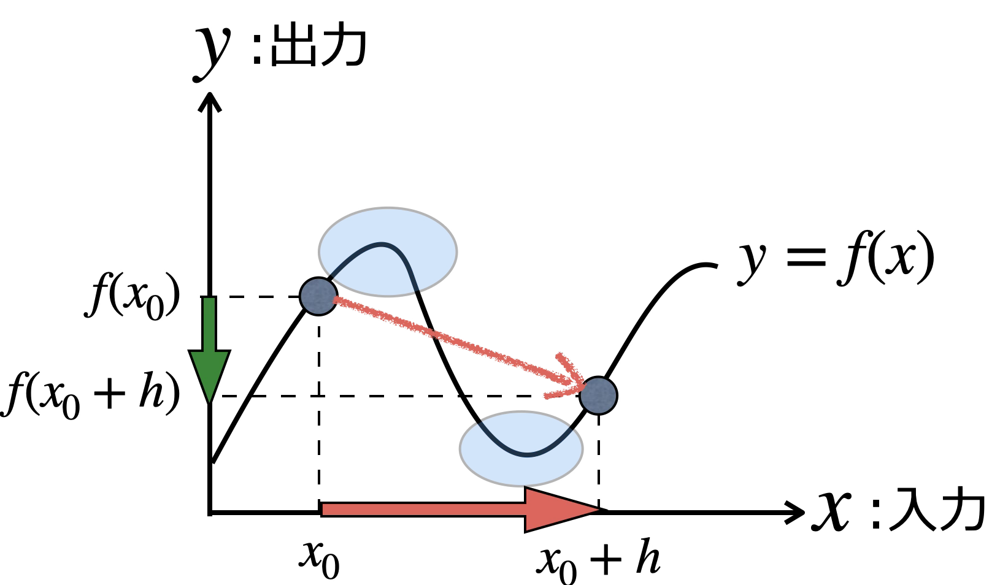
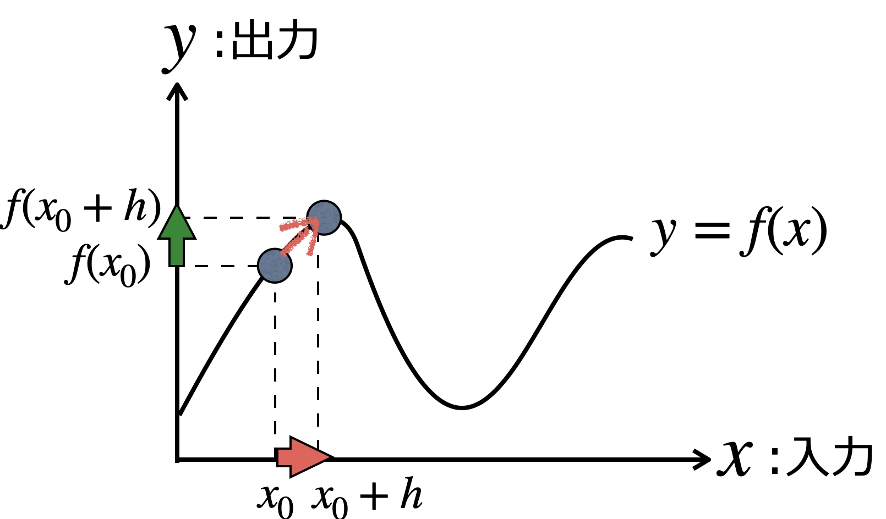
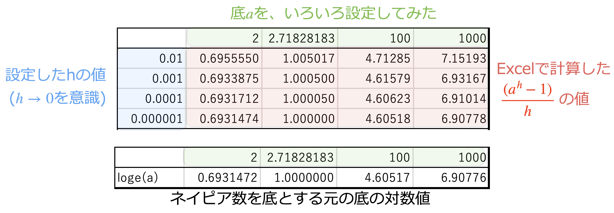

# 比率と変化率

## 変化をどう捉えるか

### 日常生活では、「差」で変化を知る

私たちは、日常における様々な変化を、**差**で知ることがほとんどである。

* バイト代が入って、貯金が2万円増えた(＋の変化)
* 毎日運動したので、先月から体重が2kg減った(ーの変化)

以前よりも「増えた」「減った」という**差**の大きさが、日常生活の変化の大きさを表していると言ってもよいだろう。

### ビジネスでは、「比率」で変化を知る

一方、ビジネスや経済の世界では、「差」を**比率**に変換して、その比率で変化を知ることが多い。

店舗で「今月の売上が**先月から**10万円増えた」という「差」が、店舗に与えるインパクトは、**先月**の売上がいくらだっかたによって大きく異なる。

* 先月の売上が10万円ならば、+10万円の売上によって、今月は20万円になった。売上は**倍増**である。
$$
\frac{\text{今月の売上}}{\text{先月の売上}} = \frac{10+10}{10} = 2
$$
* 先月の売上が100万円ならば、+10万円の売上によって、今月は110万円になった。売上はわずか10%増である。
$$
\frac{\text{今月の売上}}{\text{先月の売上}} = \frac{100+10}{10} = 1.1
$$

このように、店舗経営において売上の変化を把握するためには、**差を先月の値を基準とした比率**に換算したほうがよい。

### 関数では、「変化率」で変化を知る

関数の世界では、**入力の変化**に対応する**出力の変化**を考えることがとても多い。そこでは、ビジネスや経済と同様、**比率を用いて**入力の変化による関数の出力の変化を調べる。

さまざまな関数の出力の変化を調べるための2つの指標を導入しよう。

## 平均的な変化率を求める：平均変化率

入力が、ある値 $x_0$ から$h(>0)$だけ変化($x_0\to x_0+h$)したときの関数$f(x)$の出力の変化($f(x_0+h)-f(x_0)$)を、**平均変化率**と呼び、次式で定義する：

$$
\text{平均変化率} = \frac{f(x_0+h)-f(x_0)}{(x_0+h)-x_0} = \boxed{\frac{f(x_0+h)-f(x_0)}{h}}
$$

**入力の変化**$h$に対して**出力がどれくらい変化したか**($f(x_0+h)-f(x_0)$)を、**比率**を用いて表現している。

関数$f(x)$が、上図のような一次関数(直線)で表される場合には、関数の変化を測るための指標として、平均変化率はとても分かりやすい。

関数$f(x)$が下図のような曲線で表される場合はどうだろうか。平均変化率でみると関数は「減少している」。

しかし、入力が$+h$変化している間に、出力は上がったり下がったりしている。下図の平均変化率は、関数が繰り返す上下動の変化を正しく測れていない。

原因は、平均変化率を計算する際の入力の変化($h$)が大きすぎるのである。そこで、より小さな入力の変化を設定した方がよいのではないか、という発想が生まれる。

上図のように$h$を小さめにとれば、その間に上下動を挟むことがなくなり、関数の出力の変化をより正確に捉えることができる。

このとき、関数の平均変化率は、**$x=x_0$近辺における関数の変化を測定している**と考えることができる。

## さまざまな関数の平均変化率

ビジネス分析や機械学習、データ分析で頻繁に用いられる関数に対して、平均変化率を定義に従って計算できるようになることは、**とても重要**である。

以下、入力が$x = x_0$から$x=x_0+h$に変化したときの、関数の平均変化率を、定義に従って計算してみよう。式変形のポイントは、定義式を個別の関数の形で表現する部分（以下の計算の1行目の部分）である。

* $f(x_0)$は、関数の定義式の入力$x$の部分を、たんに$x_0$に**置き換える**だけでよい。
* $f(x_0+h)$は、関数の定義式の入力$x$の部分を$x_0+h$に置き換えて、**展開計算する**。

以下の計算では全て同じ方法で平均変化率を計算している。指数関数と対数関数については、途中で指数の法則や対数の性質を(さりげなく)使っているので、確認しておこう。

### 一次関数 $f(x) = ax + b$

$$
\begin{align*}
\frac{f(x_0+h)-f(x_0)}{h} &= \frac{(a(x_0+h)+b)-(ax_0+b)}{h}\\
&=\frac{ah}{h}\\
&=a
\end{align*}
$$
一次関数は、入力の変化($h$)に関わらず、**関数の出力の平均変化率は一定値**($a$)である。

### 二次関数 $f(x) = x^2$

$$
\begin{align*}
\frac{f(x_0+h)-f(x_0)}{h} &= \frac{(x_0+h)^2-x_0^2}{h}\\
&=\frac{x_0^2+2x_0h+h^2-x_0^2}{h}\\
&=\frac{2x_0h+h^2}{h}\\
&=2x_0+h
\end{align*}
$$
二次関数の出力の平均変化率は、$h$に依存して$2x_0+h$という式で表される。

### 三次関数 $f(x) = x^3$

$$
\begin{align*}
\frac{f(x_0+h)-f(x_0)}{h} &= \frac{(x_0+h)^3-x_0^3}{h}\\
&=\frac{x_0^3+3x_0^2h+3x_0h^2+h^3-x_0^3}{h}\\
&=\frac{3x_0^2h+3x_0h^2+h^3}{h}\\
&=3x_0^2+3x_0h+h^2
\end{align*}
$$

### 指数関数 $f(x) = a^x$

$$
\begin{align*}
\frac{f(x_0+h)-f(x_0)}{h} &= \frac{a^{x_0+h}-a^{x_0}}{h}\\
&=\frac{a^{x_0}(a^h-1)}{h}\\
&=a^{x_0}\times \frac{a^h-1}{h}\\
\end{align*}
$$

### 対数関数 $f(x) = \log_a x$

$$
\begin{align*}
\frac{f(x_0+h)-f(x_0)}{h} &= \frac{\log_a(x_0+h)-\log_a x_0}{h}\\
&=\frac{\log{\frac{x_0+h}{x_0}}}{h}\\
&=\frac{\log{\left(1+\frac{h}{x_0}\right)}}{h}\\
\end{align*}
$$

## 瞬間的な変化率を求める

入力の変化を、$x=x_0$にできるだけ近い場所に限定することで、関数$f(x)$の平均変化率をより正確に求めることができる。

そのために、$h$をできるだけ小さな値に設定していくことが必要である。例えば$h=0.0001$、$h=0.00000001$などである。すると、上で計算した関数の平均変化率の計算式について

* 二次関数の$x_0$における平均変化率$2x_0+h$は、$h$がどんどん小さくなることで、$2x_0$に近づいていく
* 三次関数の$x_0$における平均変化率$3x_0^2+3x_0h+h^2$は、$h$がどんどん小さくなるにつれ、$x_0\times h$の部分は小さくなっていき、$h^2$は急激に小さくなっていく。この結果、平均変化率は$3x_0^2$に近づいていく。

さらに、

* $a$を底とする指数関数$f(x)=a^x$の平均変化率$a^{x_0}\times \frac{a^h-1}{h}$の$\frac{a^h-1}{h}$の部分は、$h$をどんどん小さくしていくと、**ネイピア数**$e$を底とする対数値
$\log_ea$に近づいていくことが知られている。よって、指数関数の平均変化率は$x_0\times \log_ea$に近づいていく。

* $a$を底とする対数関数$f(x)=\log_a x$の平均変化率$\frac{\log{\left(1+\frac{h}{x_0}\right)}}{h}$は、$h$を0に近づけていくと、$\frac{1}{x_0\log_ea}$に近づいていくことが知られている。

以上の説明で、近づいていく先を**極限値**と呼ぶ。

* 二次関数と三次関数の極限値は、平均変化率の式で**$h\equiv 0$と代入する**ことで求めることができる。
* 指数関数・対数関数の場合は、$h$を限りなく小さくしていくと**式の中に現れてくるネイピア数**$e$を用いて極限値が求められる。

平均変化率の極限値を求める操作を、「極限をとる」と表記し$\lim_{h\to 0}$という記号で表す。このとき得られる関数の出力の平均変化率の極限値を、関数の出力の$x=x_0$における**瞬間変化率**と呼ぶことにしよう。
$$
\text{瞬間変化率} = \lim_{h\to 0}\frac{f(x_0+h)-f(x_0)}{h}
$$

## 平均変化率と瞬間変化率のまとめ

