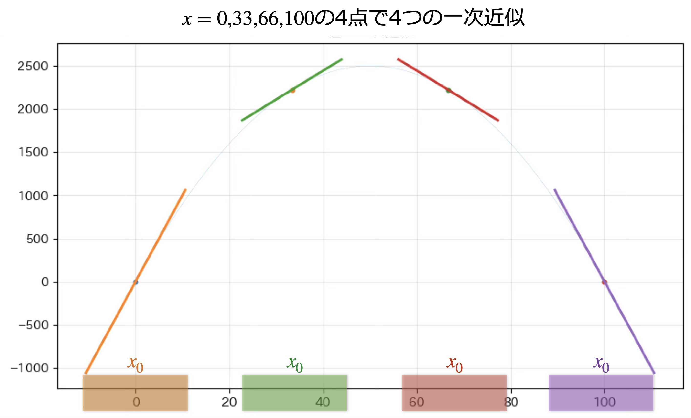
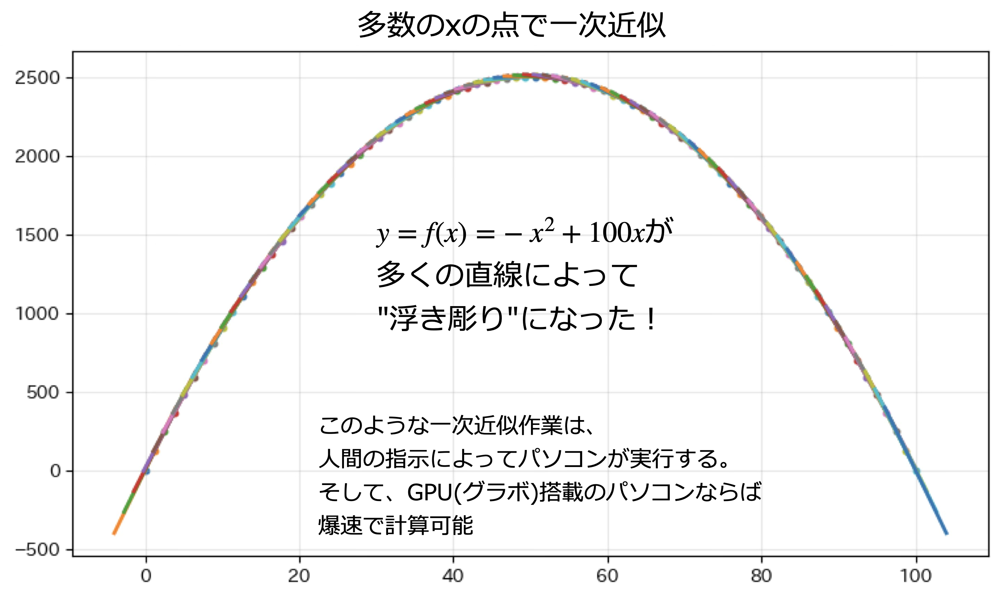
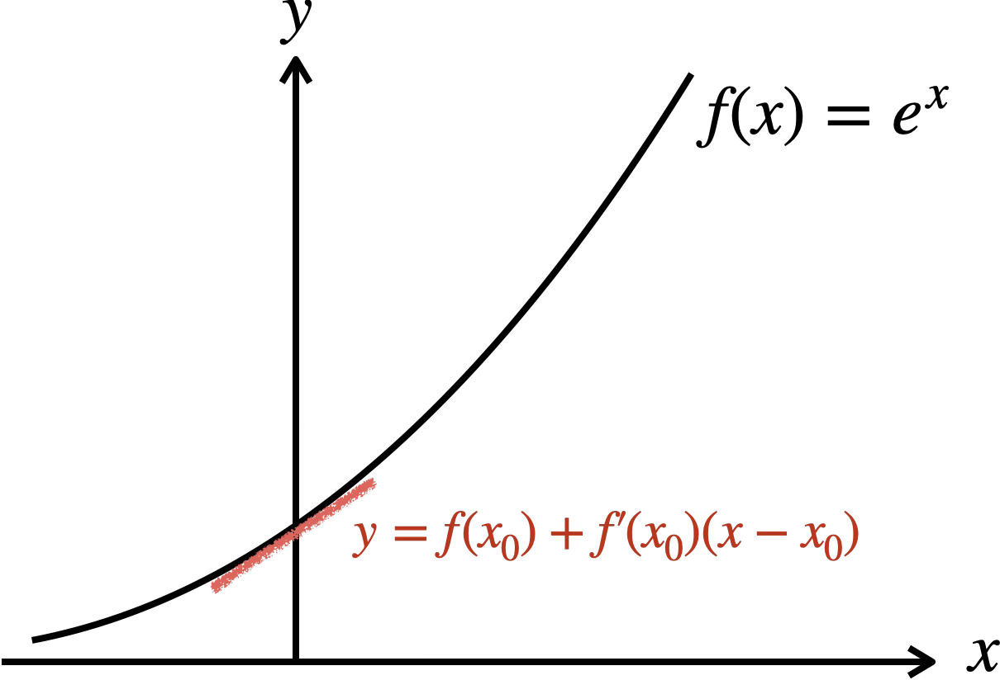
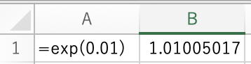

# 微分

「比率と変化率」で扱った関数の瞬間変化率は、まさに「微分」の中心となる概念である。

## 微分係数

$x=x_0$における微分係数とは、$x=x_0$における関数の出力の瞬間変化率の値のことである。


上図の関数$f(x)$の$x=0$における微分係数の値は2である。このことは、$x=0$近辺では「入力$x$の1の変化に対して
出力$f(x)$の変化は2である」ことを意味している。

この微分係数の値は、$x=0$で$f(x)$と**1点のみで接する**接線の傾きである。

$x=0$における$f(x)$の微分係数は、これまで通りの計算作業を行えばよい。まず、平均変化率は

$$
\begin{align*}
x=0\text{ での平均変化率} &= \frac{f(0+h)-f(0)}{h} \\
&= \frac{-h^2+2h}{h} = -2h+2
\end{align*}
$$

となる。よって微分係数(=瞬間変化率)は、$h\to 0$の極限をとって：

$$
\begin{align*}
x=x_0\text{ での瞬間変化率} &= \lim_{h\to 0}\frac{f(0+h)-f(0)}{h} \\
&= \lim_{h\to 0}(-2h+2) \\
&= -2\times 0 + 2 = 2
\end{align*}
$$

となる。ある入力$x=x_0$の近辺における微分係数の値はこのように求めていくことができるが、
毎回平均変化率の式から計算していくのも効率が悪い。

そこで、特定の$x_0$ではなく「任意の$x$」で微分係数を求められるようにしたい。そのための道具が「導関数」である。

## 導関数


上図では、$x=0,\,0.6,\,1.2$の3点での微分係数を、関数$f(x)$**の導関数**$f'(x)=-2x+2$の式を用いて計算している。各点で瞬間変化率の計算を行う必要がない。

### 「微分」の定義

元の関数$f(x)$から導関数$f'(x)$を求める数学演算を**微分**と呼ぶ。

「ある関数$f(x)$を**微分せよ**」という問いは、**その導関数$f'(x)$を計算する**ことと同義である。

## 微分操作の基本

データサイエンスであつかう様々な関数の導関数を求めるために、元の関数として想定される関数形の
微分を理解しておこう。これらのほとんどは、瞬間変化率の計算結果を元にしている。

### 定数の微分

データサイエンスでは、定数を常に意識する。定数とは値が変化がない数値である。その導関数は常に0である。

```{important}定数の微分

```

### $n$乗の項の微分

かなり広い範囲の関数形に対応する微分公式を理解しておこう。

```{important}n乗項の微分

```
### 指数関数

```{important}指数関数の微分
底$a$の指数関数$f(x)=a^x$の導関数は、$f'(x)=a^x\log_e a$である（ただし$e$はネイピア数）。

実用性が高いのは、底$a$をネイピア数$e$に設定したときで、このとき
$$
f(x)=e^x\quad f'(x)=e^x\log_e e = e^x
$$
```

### 対数関数

```{important}対数関数の微分
底$a$の指数関数$f(x)=a^x$の導関数は、$f'(x)=\frac{1}{x\log_ea}$である（ただし$e$はネイピア数）。

実用性が高いのは、底$a$をネイピア数$e$に設定したときで、このとき
$$
f(x)=\log_e x\quad f'(x)=\frac{1}{x\log_e e} = \frac{1}{x}
$$
```

### まとめ


## 微分演算の線形性

私たちが微分の対象とする関数は、より一般的な多項式だったり、指数関数や対数関数が組み合わさっていたり、さまざまな関数形をとる。

このような関数に対して、「微分演算の線形性」という性質を利用して、微分を数式の「パーツごとに」実行することができる。

```{note}微分演算の線形性
$$
f(x)=a\times g(x)+b\times h(x) \longrightarrow  f'(x)=a\times g'(x)+ b\times h'(x)
$$
```

なぜこのような性質が成り立つのか、実は簡単に証明することができる。まず平均変化率を計算してみよう。

$$
\begin{align*}
\frac{f(x+h)-f(x)}{h} &= \frac{\left(ag(x+h)+bh(x+h)\right)-\left(ag(x)+bh(x)\right)}{h} \\
&= \frac{ag(x+h)-ag(x)+bh(x+h)-bh(x)}{h}\\
&= \frac{ag(x+h)-ag(x)}{h}+\frac{bh(x+h)-bh(x)}{h} \\
&= a\frac{g(x+h)-g(x)}{h}+b\frac{h(x+h)-h(x)}{h}
\end{align*}
$$

このように式展開していくと、右辺には$g(x)$と$h(x)$の平均変化率の式が現れていることに気づくだろう。

よって、左辺の$f(x)$の瞬間変化率を求めることは、右辺の2つの関数の瞬間変化率を計算することに他ならない。すなわち、

$$
\begin{align*}
f'(x) &= \lim_{h\to 0} \frac{f(x+h)-f(x)}{h} \\ &= a\lim_{h\to 0}\frac{g(x+h)-g(x)}{h}+b\lim_{h\to 0}\frac{h(x+h)-h(x)}{h}
= ag'(x) + bh'(x)
\end{align*}
$$

## 一次近似

なぜ微分や導関数が大事なのだろうか？データサイエンスでは、

* **一次近似**
* **最適化**

という2つの目的のために、微分/導関数の計算が必須のツールなのである。

ここでは**一次近似**というデータサイエンスでよく使われるテクニックについて説明しよう。

**一次近似**とは、常に曲がり続ける曲線の**変化**を、大胆にも複数の直線(接線)で表現しようというテクニックである。
ひとつの直線は以下の式の右辺の式で表される、切片が$f(x_0)-f'(x_0)x_0$、傾きが$f'(x_0)$の直線である。


下図では$f(x) = -x^2+100x$という二次関数を、4つの直線で一次近似している。



連続的に曲がっている曲線をわずか4本の直線で近似的に表現するのは、少し粗すぎると思うだろう。解決策は、多数の直線で表現することである。



このような「力技」はコンピュータを使えば非常に簡単に実行できる。そして、一次近似の素晴らしさは、二次関数以外の曲線的に変化する関数だったとしても、導関数さえ存在するのであれば「一次関数で**統一的に**」近似することが可能という点である。

コンピュータのGPU(グラフィック処理)は一次関数の計算を極めて高速に実行することができるため、曲線を扱うよりも高速に計算が進むという点も、一次近似が重宝される理由である。

### 一次近似問題の解き方

関数$f(x)$の$x=x_0$における一次近似の問題では、一次近似式：
$$
f(x) \simeq f(x_0)+f'(x_0)(x-x_0)
$$
の左辺にある**元の関数**の値を、右辺の**近似する直線**が精度よく算出できるか、ということを問うことが多い。

ここでは、$x=0$における、$f(x)=e^x$の一次近似問題を考えてみよう。



**STEP1** 
まずは$x=0$での**一次近似式を確定**しよう。(e^x)'=e^xであることから、

$$
\begin{align*}
e^x &\simeq f(x_0)+f'(x_0)(x-x_0) \\
 &= f(0)+f'(0)(x-0) \\
 &= e^0 + e^0(x-0) \\
 &= 1+x
\end{align*}
$$

となることを確認しよう。ネイピア数を底とする指数関数$f(x)=e^x$は、$x=0$近辺に限っていえば、$1+x$という直線で近似できるということである。

**STEP2** 
その近似の精度を評価するために、$x=0.01$における指数関数$f(x)$の値$e^{0.01}$と、$x=0$での一次近似式$1+x$の値を比較してみよう。近似の精度が高いならば、関数の値$e^{0.01}$と、一次近似式から計算した値$1+0.01$は、十分に近くなるはずである。



上図はExcelを使って求めた$e^{0.01}$の値で1.01005017である。一次近似式では$1+x=1+0.01=1.01$であるから、確かに十分近い値になっていることが分かる。この近似の精度の高さが、データサイエンスにて複雑な関数を一次近似することのモチベーションになっている。